# ER Diagram

Auto-generated by `lsdb erdiagram` on 2026-07-09T16:22:42.701Z. Re-run after schema changes to refresh.

## Tables by actor

- **admin**: actions, banners, bcombo_transactions, blocked_schedules, categories, category_addon_items, category_addons, category_category_addons, category_product_options, category_products, cleaners, coupons, finance_orders, items, modules, orders, payment_links, platforms, popular_service_items, popular_services, product_options, products, push_notifications, role_permissions, roles, task_info, topup_transactions, users

## Diagram

```mermaid
erDiagram
    actions {
        string key UK
        string label
        date _created_at
        date _updated_at
        date _deleted_at
        string _id PK
    }
    banners {
        string name
        string title_en
        string type
        boolean status
        date start_date
        date expired_date
        number sort
        string img_url_en
        boolean has_detail
        boolean has_topup
        number credit
        number amount
        date _created_at
        date _updated_at
        date _deleted_at
        string _id PK
    }
    bcombo_transactions {
        string transaction_id UK
        string customer_name
        string bundle_name
        number amount
        string payment_method
        string status
        date completed_at
        date _created_at
        date _updated_at
        string _id PK
    }
    blocked_schedules {
        string name
        date blocked_date
        string start_time
        string end_time
        string cleaner_ids
        string associated_address
        date _created_at
        date _updated_at
        date _deleted_at
        string _id PK
    }
    categories {
        string name_en
        string name_km
        string thumbnail_url
        boolean status
        number sort
        json platform
        date _created_at
        date _updated_at
        date _deleted_at
        string _id PK
    }
    category_addon_items {
        string addon_id FK
        string name_en
        string name_km
        string type
        string img_url
        number amount
        number duration
        boolean status
        number sort
        date _created_at
        date _updated_at
        date _deleted_at
        string _id PK
    }
    category_addons {
        string name_en
        string name_km
        string badge_en
        string badge_km
        string selection_type
        boolean is_required
        boolean status
        date _created_at
        date _updated_at
        date _deleted_at
        string _id PK
    }
    category_category_addons {
        string category_id FK
        string addon_id FK
        number sort
        date _created_at
        date _updated_at
        string _id PK
    }
    category_product_options {
        string category_product_id FK
        string product_option_id FK
        number price
        number duration
        number sort
        date _created_at
        date _updated_at
        string _id PK
    }
    category_products {
        string category_id FK
        string product_id FK
        number sort
        date _created_at
        date _updated_at
        string _id PK
    }
    cleaners {
        string name
        string gender
        string role
        boolean status
        string image_url
        string phone
        date joined_date
        boolean auto_assign
        string expertises
        string weekly_offs
        date _created_at
        date _updated_at
        date _deleted_at
        string _id PK
    }
    coupons {
        string name
        string code UK
        string type
        number value
        boolean status
        string target_user
        string promo_text_en
        string remark
        date effective_date
        date expired_date
        boolean is_new_user_only
        number total_usage_limit
        date _created_at
        date _updated_at
        date _deleted_at
        string _id PK
    }
    finance_orders {
        string order_id FK
        string customer_name
        string customer_phone
        string service_category
        string specific_service
        date schedule_date
        string time
        string address
        string status
        date payment_init_date
        date payment_completed_date
        string payment_method
        string promo_code
        number original_price
        number discount
        number service_fee
        number transport_fee
        number net_revenue
        number vat
        number total_fee
        string remark
        date _created_at
        date _updated_at
        string _id PK
    }
    items {
        string name_en
        string name_km
        string category
        boolean status
        number sort_order
        date _created_at
        date _updated_at
        date _deleted_at
        string _id PK
    }
    modules {
        string key UK
        string label
        string section
        json action_ids
        date _created_at
        date _updated_at
        date _deleted_at
        string _id PK
    }
    orders {
        string bulk_order_id
        string customer_first_name
        string customer_last_name
        string customer_phone
        string profile_url
        string category
        string service_type
        date schedule_date
        number duration
        string address
        string status
        string payment_status
        string payment_method
        string coupon_code
        number amount
        number service_fee
        number transport_fee
        number vat_fee
        number discount
        number net_revenue
        string note
        string type
        number exchange_rate
        string assigned_cleaner_id FK
        string newsletter_subscription
        date _created_at
        date _updated_at
        string _id PK
    }
    payment_links {
        string customer_id
        string customer_name
        number amount
        string status
        date expiry_date
        date paid_at
        string remark
        date _created_at
        date _updated_at
        string _id PK
    }
    platforms {
        string name_en UK
        string name_km
        string description
        boolean status
        string visibility
        date _created_at
        date _updated_at
        date _deleted_at
        string _id PK
    }
    popular_service_items {
        string popular_service_id FK
        string type
        string category_id FK
        string product_id FK
        number priority
        date _created_at
        date _updated_at
        string _id PK
    }
    popular_services {
        string name_en
        string name_km
        string image_url
        boolean status
        number display_order
        date _created_at
        date _updated_at
        date _deleted_at
        string _id PK
    }
    product_options {
        string name_en
        string name_km
        string type
        boolean status
        date _created_at
        date _updated_at
        date _deleted_at
        string _id PK
    }
    products {
        string name_en
        string name_km
        string thumbnail_url
        boolean status
        number sort
        date _created_at
        date _updated_at
        date _deleted_at
        string _id PK
    }
    push_notifications {
        string name
        string title_en
        string body_en
        string type
        string schedule_type
        date scheduled_at
        string status
        string audience
        string target_user_ids
        date _created_at
        date _updated_at
        string _id PK
    }
    role_permissions {
        string role_id FK
        string module_id FK
        string action_id FK
        date _created_at
        date _updated_at
        string _id PK
    }
    roles {
        string name UK
        string code UK
        string description
        string status
        string created_by
        date _created_at
        date _updated_at
        date _deleted_at
        string _id PK
    }
    task_info {
        string category_id FK
        string product_id FK
        number sort
        string title_en
        string title_km
        json description_en
        json description_km
        date _created_at
        date _updated_at
        date _deleted_at
        string _id PK
    }
    topup_transactions {
        string transaction_id UK
        string customer_name
        string customer_phone
        number amount
        string payment_method
        string status
        date completed_at
        date _created_at
        date _updated_at
        string _id PK
    }
    users {
        string user_id UK
        string name
        string role_id FK
        string email UK
        string actor_sheet_id
        string status
        string password_hash
        string profile_url
        date _created_at
        date _updated_at
        string _id PK
    }

    category_addons ||--o{ category_addon_items : "addon_id"
    categories ||--o{ category_category_addons : "category_id"
    category_addons ||--o{ category_category_addons : "addon_id"
    category_products ||--o{ category_product_options : "category_product_id"
    product_options ||--o{ category_product_options : "product_option_id"
    categories ||--o{ category_products : "category_id"
    products ||--o{ category_products : "product_id"
    orders ||--o{ finance_orders : "order_id"
    cleaners ||--o{ orders : "assigned_cleaner_id"
    popular_services ||--o{ popular_service_items : "popular_service_id"
    categories ||--o{ popular_service_items : "category_id"
    products ||--o{ popular_service_items : "product_id"
    roles ||--o{ role_permissions : "role_id"
    modules ||--o{ role_permissions : "module_id"
    actions ||--o{ role_permissions : "action_id"
    categories ||--o{ task_info : "category_id"
    products ||--o{ task_info : "product_id"
    roles ||--o{ users : "role_id"
```

